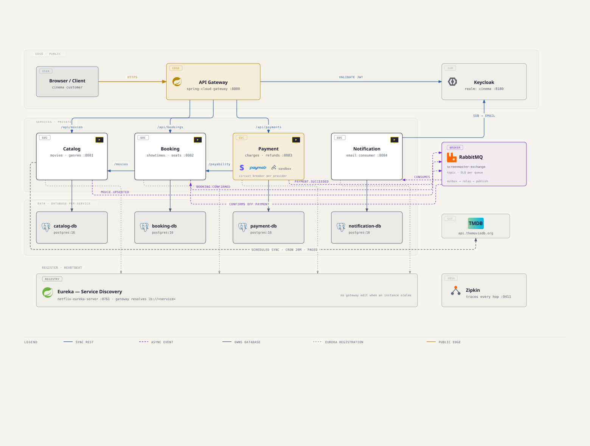
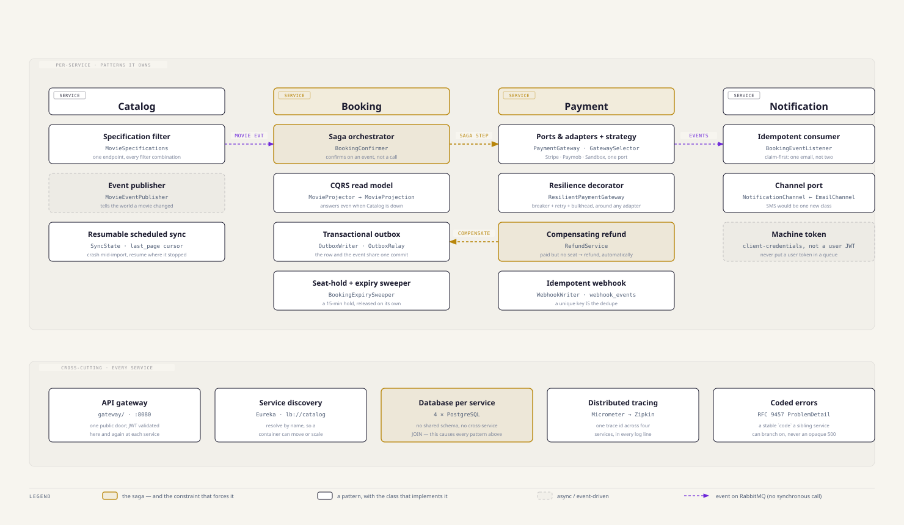

# ScreenMaster — Microservices

[](https://github.com/mohamedkhaled2811/ScreenMasterMicroservices/actions/workflows/ci.yml)

A cinema booking system, split into microservices — and a **place to read real microservices patterns in working code** instead of in toy examples.

Every pattern here (saga, outbox, idempotent consumer, CQRS read model, circuit breaker, database-per-service) is load-bearing: something breaks if you remove it. Each one is linked below to the exact class that implements it and to a short explainer of why it's there.

---

## What the app does

ScreenMaster is a cinema. A user can:

- **Browse movies** — a catalog synced from TMDB, searchable by title, genre, language, year, and rating.
- **See what's playing** — showtimes for a movie, on a screen, in a theater.
- **Pick seats and book them** — the seat is held for **15 minutes** while they pay. Nobody else can take it in that window.
- **Pay** — via Stripe, Paymob, or a built-in sandbox gateway. The booking is confirmed only when the payment provider says the money arrived.
- **Get an email** — a ticket on success, a notice if the payment failed.
- **Get refunded automatically** if the money lands but the seat is gone (the hold expired first).

Admins manage theaters, screens, seat layouts, seat types (with price multipliers), and showtimes.

Two rules run through the whole system: **a seat is sold once**, and **the user never names their own price** — every amount is derived server-side from the showtime's base price times the seat type's multiplier.

---

## The services

Five services, a database each, one public door.

| Service | Port | What it owns | Database |
|---|---|---|---|
| **gateway** | `8080` | the only public entrypoint — routing, JWT validation, Swagger aggregation | — |
| **discovery** | `8761` | Eureka — services find each other by name, not by IP | — |
| **catalog** | `8081` | movies, genres, the TMDB sync | `catalog-db` |
| **booking** | `8082` | theaters, screens, seats, showtimes, bookings | `booking-db` |
| **payment** | `8083` | payments, attempts, refunds, webhooks | `payment-db` |
| **notification** | `8084` | emails, delivery tracking | `notification-db` |

Supporting containers: **Keycloak** (identity), **RabbitMQ** (events), **Zipkin** (tracing), **Mailpit** (a fake inbox you can open).

**Booking is deliberately fat.** It absorbed three bounded contexts from the monolith — inventory, scheduling, and booking — because they share one invariant that cannot be split across a network: *this seat, in this room, at this time, is held exactly once.* Splitting them would have turned a database constraint into a distributed transaction. See [service-decomposition-ddd.md](docs/concepts/service-decomposition-ddd.md).



---

## Patterns, and where to read them

This is the part to actually click through. Each row is a real pattern, the class that implements it, and why it exists.



### Microservices patterns

| Pattern | Where it lives | Why it's there |
|---|---|---|
| **Database per service** | one Postgres per service in [`compose.yaml`](compose.yaml) | no shared schema, no cross-service JOIN, no cross-service FK — [concept](docs/concepts/database-per-service.md) |
| **API gateway** | [`gateway/`](gateway/) | one public door; the four services are never exposed — [concept](docs/concepts/api-gateway-and-bff.md) |
| **Service discovery** | [`discovery/`](discovery/), `lb://catalog` URIs | services resolve by name, so containers can move — [concept](docs/concepts/service-discovery.md) |
| **Saga (orchestrated)** | [`BookingConfirmer`](booking/src/main/java/com/gr74/booking/service/BookingConfirmer.java) · [`RefundService`](payment/src/main/java/com/gr74/payment/service/RefundService.java) | two databases, no distributed transaction — a failed step is undone by an **opposite** step, not a rollback — [concept](docs/concepts/saga-pattern.md) |
| **Transactional outbox** | [`OutboxWriter`](payment/src/main/java/com/gr74/payment/service/OutboxWriter.java) + [`OutboxRelay`](payment/src/main/java/com/gr74/payment/outbox/OutboxRelay.java) | the DB write and the event publish can't disagree, because there's only one commit — [concept](docs/concepts/transactional-outbox.md) |
| **Idempotent consumer** | [`WebhookWriter`](payment/src/main/java/com/gr74/payment/service/WebhookWriter.java) · [`BookingEventListener`](notification/src/main/java/com/gr74/notification/messaging/BookingEventListener.java) | delivery is at-least-once, so every consumer must survive seeing the same event twice — [concept](docs/concepts/idempotent-consumer.md) |
| **CQRS read model** | [`MovieProjector`](booking/src/main/java/com/gr74/booking/service/MovieProjector.java) → [`MovieProjection`](booking/src/main/java/com/gr74/booking/model/MovieProjection.java) | Booking keeps its own copy of movie titles, so "my bookings" still answers when Catalog is down — [concept](docs/concepts/cqrs-read-model.md) |
| **Circuit breaker · retry · bulkhead** | [`ResilientPaymentGateway`](payment/src/main/java/com/gr74/payment/gateway/ResilientPaymentGateway.java) | a slow payment provider must not take Payment's threads down with it — [concept](docs/concepts/resilience-patterns.md) |
| **Async messaging** | [`screenmaster-exchange`](docs/concepts/rabbitmq.md), all `messaging/` packages | events decouple lifetimes: Notification can be down and nothing else notices — [concept](docs/concepts/sync-vs-async-comms.md) |
| **Token relay + machine tokens** | [`UserTokenRelayInterceptor`](payment/src/main/java/com/gr74/payment/security/UserTokenRelayInterceptor.java) | a user JWT is relayed on sync calls; a queue consumer uses its **own** client-credentials token — never a user's — [concept](docs/concepts/security-jwt-oauth2.md) |
| **Distributed tracing** | Micrometer + Zipkin, trace id in every log line | one id follows a request across all four services — [concept](docs/concepts/observability.md) |

### Design patterns that carry weight here

| Pattern | Where it lives | Why it's there |
|---|---|---|
| **Ports & adapters + strategy** | [`PaymentGateway`](payment/src/main/java/com/gr74/payment/gateway/PaymentGateway.java) ← Stripe · Paymob · Sandbox, resolved by [`GatewaySelector`](payment/src/main/java/com/gr74/payment/gateway/GatewaySelector.java) | adding a fourth provider is a new class — **no existing code changes**, and no `if/else` on gateway type exists outside `gateway/` — [concept](docs/concepts/payment-gateway-integration.md) |
| **Decorator** | [`ResilientPaymentGateway`](payment/src/main/java/com/gr74/payment/gateway/ResilientPaymentGateway.java) wraps any `PaymentGateway` | resilience is added *around* the adapters, so no adapter knows about circuit breakers |
| **Specification** | [`MovieSpecifications`](catalog/src/main/java/com/gr74/catalog/repository/spec/MovieSpecifications.java) and `booking/.../spec/` | a nullable filter DTO composes into a query — an absent field is a no-op, so one endpoint serves every filter combination — [concept](docs/concepts/pagination-and-filtering.md) |
| **Outbox relay worker** | `@Scheduled` + `FOR UPDATE SKIP LOCKED` | many instances drain the same table without stepping on each other |

**Conventions worth copying:** every list endpoint is paginated (no unbounded dumps), every error is an RFC 9457 `ProblemDetail` with a machine-readable `code`, every enum is `@Enumerated(STRING)`, and schema is Liquibase-migrated with `ddl-auto=validate`.

**Want the full library?** [`docs/concepts/`](docs/concepts/) has one short explainer per pattern, annotation, and tool — 34 of them. Start at its [README](docs/concepts/README.md).

---

## Run it

**You need:** Docker + Docker Compose, and JDK 21 (only if you want to build outside Docker).

```bash
git clone https://github.com/mohamedkhaled2811/ScreenMasterMicroservices.git
cd ScreenMasterMicroservices

cp .env.example .env          # works as-is; see below for the optional keys
docker compose up --build     # first run takes a few minutes
```

That's it. Everything comes up: five services, four databases, Keycloak, RabbitMQ, Zipkin, and a fake mail inbox.

### Where things are

| What | URL |
|---|---|
| **API (the only public door)** | http://localhost:8080 |
| **Swagger UI** (all services, one page) | http://localhost:8080/swagger-ui.html |
| **Mailpit** — the emails the app sends | http://localhost:8025 |
| **Zipkin** — trace one request across services | http://localhost:9411 |
| **Eureka** — who's registered | http://localhost:8761 |
| **RabbitMQ** — queues and event flow (`guest`/`guest`) | http://localhost:15672 |
| **Keycloak** — realm `cinema` | http://localhost:8180 |

### Get a token and some data

```bash
./scripts/get-token.sh              # a JWT for a seeded user
./scripts/seed-demo-cinema.sh       # a theater, screens, a seat grid, showtimes
```

Everything is authenticated — a call with no token gets a `401` at the gateway, and also at the service behind it (zero trust, not just a perimeter).

### Optional keys

`.env.example` works without editing. Two things stay off until you fill them in:

- **`TMDB_API_KEY`** + `TMDB_SYNC_ENABLED=true` — fills the catalog with real movies from TMDB.
- **Stripe / Paymob test keys** — enables those gateways. Without them, only the **Sandbox** gateway is offered, which is enough for the whole booking → payment → refund flow. Live keys are rejected at startup: this repo is incapable of moving real money.

### Postman

A full collection lives at [`docs/postman/ScreenMaster.postman_collection.json`](docs/postman/ScreenMaster.postman_collection.json) — import it into Postman, and every endpoint in this README is one click away, against `localhost:8080`.

### Running one service

```bash
./mvnw -pl catalog spring-boot:run   # needs JDK 21
docker compose logs -f booking       # follow one service's logs
```

---

## Try the interesting failure

The point of this repo is the parts that go wrong. The quickest one to see:

1. Book a seat → it's held `PENDING` for 15 minutes.
2. Don't pay. Wait for the hold to lapse (`HOLD_WINDOW` in `BookingService`, if you want it shorter).
3. Now pay anyway.

Payment takes the money and publishes `payment-succeeded`. Booking says *no — that seat is gone* and publishes `booking-confirmation-rejected`. Payment's listener picks it up and **refunds in full, automatically**.

No transaction spanned those two databases. The failure was undone by a new, opposite action. That's a saga, and you can watch it happen in Zipkin and Mailpit.

---

## Where to look

| I need… | Go to |
|---|---|
| A pattern explained | [`docs/concepts/`](docs/concepts/) |
| One service in depth | [`booking/README.md`](booking/README.md) · [`payment/README.md`](payment/README.md) · [`notification/README.md`](notification/README.md) |
| Why the system splits this way | [`docs/ARCHITECTURE_AND_SCHEMA.md`](docs/ARCHITECTURE_AND_SCHEMA.md) |
| What was built, in order | [`docs/BUILD_PLAN.md`](docs/BUILD_PLAN.md) |
| The theory behind it all | [`docs/microservices-interview-field-guide.md`](docs/microservices-interview-field-guide.md) |
| The diagrams | [`docs/diagrams/`](docs/diagrams/) and each service's `docs/diagrams/` |

---

## Stack

Spring Boot 4.1 · Java 21 · Spring Cloud 2025.1.2 · Spring Cloud Gateway · Eureka · Spring Data JPA · Spring Security (OAuth2 resource server) · PostgreSQL · RabbitMQ · Liquibase · Resilience4j · Micrometer + Zipkin · Keycloak · springdoc-openapi · Lombok · Maven · Docker Compose.
