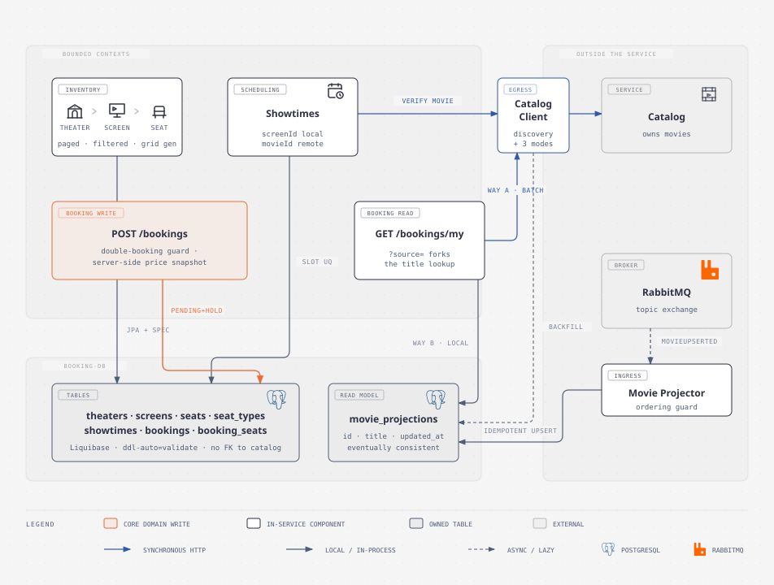
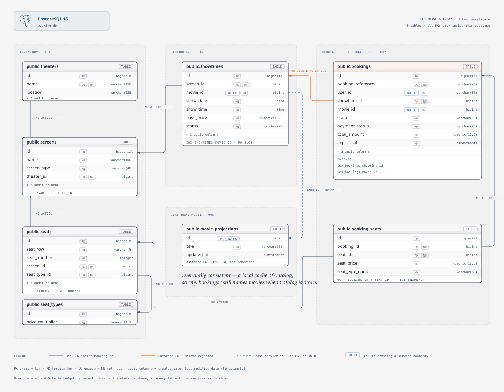
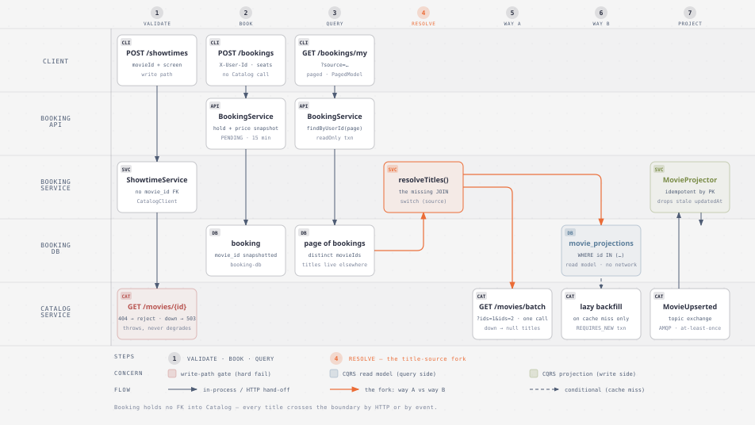

# Booking Service

The reservation core of ScreenMaster. Booking absorbed **three bounded contexts** from the monolith — **Inventory** (theaters → screens → seats → seat types), **Scheduling** (showtimes), and **Booking** itself (the reservation and its frozen line items) — because they share one invariant that cannot be split across a network: *this seat, in this room, at this time, is held exactly once.*

It owns `booking-db`, holds **no foreign key into Catalog**, and reaches the rest of the system two ways: synchronously over HTTP (`lb://catalog`, Eureka-resolved) and asynchronously over RabbitMQ.

| | |
|---|---|
| **Port** | `8082` |
| **Database** | `booking-db` (PostgreSQL, Liquibase-migrated, `ddl-auto=validate`) |
| **Sync dependency** | `catalog` via `CatalogClient` (`lb://catalog`) |
| **Async input** | `MovieUpserted` from `screenmaster-exchange` → `booking-movie-titles-queue` |
| **API docs** | `/swagger-ui.html` · spec at `/v3/api-docs` (aggregated by the gateway on `:8080`) |

---

## Architecture



The three contexts sit on top, each hanging off the tables it owns; the two edges to the outside world run down the sides. `POST /bookings` is highlighted because it is the service's **core domain write** — the only place a real invariant is defended.

`BookingService.create` runs six ordered guards:

1. the showtime must exist — it carries the screen, the `movieId`, and the `basePrice`
2. every requested seat id must resolve (input de-duplicated first)
3. every seat must sit on **this showtime's screen** — no reserving a seat from another room
4. **double-booking guard** — reject if a seat is already held (`PENDING`/`CONFIRMED`), backstopped by the `uq_booking_seats_booking_seat` constraint
5. **price derived server-side** — `showtime.basePrice × seatType.priceMultiplier`, frozen onto each line item; a client never names its own price
6. persist as `PENDING` with a 15-minute hold (`expiresAt`)

Payment and compensation are deliberately absent — that orchestration is the Phase-3 saga, which will *wrap* this create rather than replace it.

📄 Full walkthrough: [`docs/diagrams/architecture-booking-service.md`](docs/diagrams/architecture-booking-service.md)

---

## Database schema



Seven tables in one database, in three clusters that mirror the three contexts:

| Cluster | Tables | Notes |
|---|---|---|
| **Inventory** | `theaters` → `screens` → `seats`, `seat_types` | a real FK chain — containment enforced by the database, because it is all inside one boundary |
| **Scheduling** | `showtimes` | FK to `screens`; `movie_id` is a **plain column, not an FK** |
| **Booking** | `bookings` → `booking_seats` | line items reference `seats`; `uq_booking_seats_booking_seat` is the last line of defence against double-booking |
| **Read model** | `movie_projections` | a cache Booking *owns*, not a shared table (see CQRS below) |

The one thing worth reading twice: **there is no FK to Catalog anywhere.** The monolith's `booking → showtime → movie` JOIN is cut. `movie_id` is a snapshotted id validated at write time over HTTP, and every immutable fact a booking needs (seat price, total) is **snapshotted onto the row at creation** so a later price change never rewrites history.

`movie_projections` uses an **assigned** primary key — the TMDB movie id that Catalog owns — which is what makes the event consumer idempotent for free.

---

## Booking integration — the cross-service reads



This is the service's most interesting page: every place Booking crosses the boundary, and its **two different answers** to "the JOIN is gone."

### Three synchronous Catalog calls, three failure contracts

They answer failure differently *on purpose* — a write, a read, and a cache-fill each need a different answer:

| Call site | Method | On 404 | On outage |
|---|---|---|---|
| **Validate** (`POST /showtimes`) | `verifyMovieExists` | reject the write (`404 BOOKING_MOVIE_NOT_FOUND`) | reject the write (`503 BOOKING_CATALOG_UNAVAILABLE`) |
| **Way A** (`GET /bookings/my`) | `titlesByIds` (batched) | id absent from the map | **degrade** — empty map, `movieTitle: null` |
| **Way B** (lazy backfill) | `titleById` | `Optional.empty()`, safe to serve null | **throw** — must not poison the cache |

A write must reject an unverifiable id; a read is more useful partial than absent; a cache-fill has to tell the two apart because it *persists* the answer.

### The fork: `GET /bookings/my?source=`

The same endpoint, the same `MyBookingDto` — only the title's provenance changes:

- **`composition`** (default, way A) — one **batched** Catalog call per page (`/movies/batch?ids=…`, not one call per row — that's the network N+1). Fresh, but a Catalog outage means null titles.
- **`readmodel`** (way B) — a local `WHERE id IN (…)` against `movie_projections`. Survives a Catalog outage for already-cached movies, at the price of eventual consistency. A genuine miss triggers one lazy backfill in a `REQUIRES_NEW` transaction — the read path runs `readOnly`, so the write must be delegated or it would be **silently dropped**.

Stop Catalog and call both back-to-back: that divergence is the whole lesson.

📄 Full walkthrough: [`docs/diagrams/process-booking-integration.md`](docs/diagrams/process-booking-integration.md)

### Saga — booking → payment

*Coming in Phase 3.* `POST /bookings` currently stops at `PENDING` with a 15-minute hold. The saga will orchestrate payment, confirmation, and compensation (release the seats on failure or expiry) around that existing create.

> 🖼️ **A saga diagram will be added here** once the flow lands, following the same authoring spec as the three above.

---

## Patterns used here

Each is wired in real code, not demoed. Diagrams exist for the first three; **the rest will get their own as they land** — the goal is that every pattern below is eventually readable as a picture, not just prose.

| Pattern | Where it lives | Why it's here |
|---|---|---|
| **CQRS read model** | `MovieProjector`, `MovieReadModel`, `movie_projections` | Booking keeps its own query-optimised copy of Catalog titles so reads survive a Catalog outage. Write side is the event consumer; read side is a local join. |
| **API composition** | `BookingService`, `CatalogClient.titlesByIds` | The other answer to the lost JOIN — fan out at read time, batched to avoid the network N+1. |
| **Database per service** | `booking-db`, no cross-service FKs | The boundary is the schema. Cross-service references are ids, resolved over API or events. |
| **Snapshotting immutable facts** | `booking_seats.seat_price` + `seat_type_name`, `bookings.total_amount`, `bookings.movie_id` | A booking records what was true *when it was made*; upstream changes never rewrite history. |
| **Event-driven integration** | `MovieUpsertedListener` → `MovieProjector` | Catalog publishes to a topic exchange knowing nothing about consumers; Booking owns its queue and binding. |
| **Idempotent consumer** | `MovieProjector.apply` | RabbitMQ is at-least-once. The PK is the assigned movie id, so a redelivery just rewrites the same row — no dedupe table needed (contrast Notification, whose side effect isn't naturally idempotent). |
| **Ordering guard** | `MovieProjector` | Redeliveries aren't globally ordered, so an event whose `updatedAt` isn't strictly newer than what's stored is dropped — a late event can't overwrite a fresher title. |
| **Synchronous validation of a cut FK** | `ShowtimeService` → `verifyMovieExists` | The DB can't enforce `movie_id` any more, so the service does — accepting temporal coupling on the write path, deliberately. |
| **RFC 9457 error contract** | `BookingErrorCode`, `GlobalExceptionHandler` | Every error is `application/problem+json` with a stable machine-readable `code` siblings can branch on. |
| **Pagination + dynamic filtering** | `TheaterController`, `repository/spec/*`, `WebPagingConfig` | Listings never dump. Nullable filter DTO → composed JPA `Specification`, bounded page size, whitelisted sort fields, stable `PagedModel` envelope. |
| **Auth seam** | `@CurrentUser`, `CurrentUserArgumentResolver` | Today the resolver reads `X-User-Id`; in Phase 7 it reads the JWT `sub`. Controllers, services, and the `user_id` column are unchanged. |
| **Saga (orchestrated)** | *Phase 3* | Payment, confirmation, and compensation around the `PENDING` hold. |

---

## API surface

**Bookings** — `POST /bookings` · `GET /bookings/my?source=composition|readmodel`
**Showtimes** — `POST /showtimes` · `GET /showtimes/{id}` · `GET /showtimes/movie/{movieId}` · `GET /showtimes/movie/upcoming/{movieId}` · `GET /showtimes/screen/{screenId}` · `DELETE /showtimes/{id}`
**Inventory** — `GET|POST /theaters` · `DELETE /theaters/{id}` · `GET|POST /theaters/{id}/screens` · `DELETE /screens/{id}` · `GET|POST /screens/{id}/seats` · `POST /screens/{id}/seats/grid` · `DELETE /seats/{id}` · `GET|POST /seat-types` · `DELETE /seat-types/{id}`

Inventory listings return the paged `PagedModel` envelope (0-indexed).

> ⚠️ **Known gap:** the showtime list endpoints still return a bare `List<ShowtimeResponse>` rather than a `Page`, which breaks the repo-wide "listings paginate; they never dump" rule. Worth fixing before this service is described as finished.

---

## Running it

```bash
# needs Postgres on :5432 and RabbitMQ on :5672 (docker compose up -d postgres rabbitmq)
./mvnw -q -pl booking spring-boot:run

./mvnw -q -pl booking test
```

Config is env-var driven with local-dev defaults: `BOOKING_DB_URL`, `BOOKING_DB_USER`, `BOOKING_DB_PASSWORD`, `RABBITMQ_HOST`, `EUREKA_SERVICE_URL`.

---

## Where to look

| I need… | Go to |
|---|---|
| Why the service is shaped this way | [`docs/diagrams/architecture-booking-service.md`](docs/diagrams/architecture-booking-service.md) |
| How the cross-service reads work | [`docs/diagrams/process-booking-integration.md`](docs/diagrams/process-booking-integration.md) |
| What a pattern or annotation means | [`../docs/concepts/`](../docs/concepts/) |
| What's next for this service | [`../docs/BUILD_PLAN.md`](../docs/BUILD_PLAN.md) |
