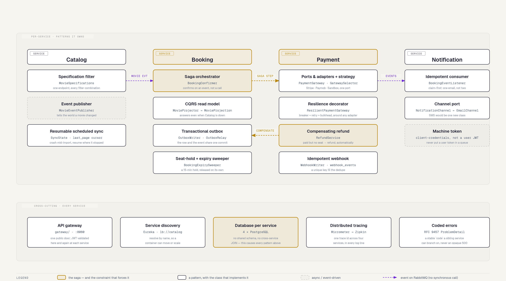

# ScreenMaster · Patterns Map

**Type:** high-level (whole-system) · **Scope:** which pattern lives in which service
**Files:** `patterns-map.html` (source) · `.svg` · `.png`



## What to learn here

One idea: **the patterns are not decoration — they are consequences.** The gold box in the
cross-cutting band, *database per service*, is the cause. Everything above it is an effect.

Once four services own four separate databases, you lose the three things a monolith gave you for
free, and each loss has a named replacement:

| What you lost | What replaces it | Where |
|---|---|---|
| the JOIN across tables | a **CQRS read model** — keep a local copy, fed by events | `MovieProjector` in Booking |
| the transaction across writes | a **saga** — a failed step is undone by an opposite step | `BookingConfirmer` + `RefundService` |
| "the write and the publish both happened" | a **transactional outbox** — one commit covers both | `OutboxWriter` + `OutboxRelay` |

That is the whole diagram. Read it top-down and it's a list of patterns; read it bottom-up and it's
a causal chain.

## Why it's laid out this way

**Columns are services, rows are roughly comparable concerns.** A reader scanning across row two
sees four different answers to "how does this service talk to the others" — Catalog publishes,
Booking orchestrates, Payment adapts, Notification consumes.

**Gold is spent on exactly three things** (the skill's budget allows two focal elements; the third
is the cause-node in the band below, which sits in its own zone): the saga's two halves —
`BookingConfirmer` and `RefundService` — and `database per service`. That's the argument the diagram
is making. Everything else is neutral.

**Dashed = async.** Every cross-service edge here is dashed, because every one of them is an event on
RabbitMQ. There is exactly one synchronous cross-service call in the whole system (Booking → Catalog,
to validate a `movieId` when a showtime is created), and it is deliberately *not* on this diagram —
see `booking/docs/diagrams/process-booking-integration.md`.

## The saga, read off the diagram

The two gold arrows between Booking and Payment are the whole of Phase 3:

1. **Saga step** (forward) — Booking's outbox emits; Payment charges the card.
2. **Compensate** (return) — Payment paid, but Booking's 15-minute hold had already lapsed and the
   seat was released. Booking emits `booking-confirmation-rejected`, and `RefundService` refunds in
   full, automatically.

No transaction spanned `booking-db` and `payment-db`. Nothing was rolled back. The failure was
corrected by a **new, opposite action** — which is the definition of a saga, and the reason the
return arrow gets its own colour.

## Patterns → concepts

- **Database per service** → [concepts/database-per-service.md](../concepts/database-per-service.md)
- **Saga / compensating transaction** → [concepts/saga-pattern.md](../concepts/saga-pattern.md)
- **Transactional outbox** → [concepts/transactional-outbox.md](../concepts/transactional-outbox.md)
- **CQRS read model** → [concepts/cqrs-read-model.md](../concepts/cqrs-read-model.md)
- **Idempotent consumer** → [concepts/idempotent-consumer.md](../concepts/idempotent-consumer.md)
- **Circuit breaker · retry · bulkhead** → [concepts/resilience-patterns.md](../concepts/resilience-patterns.md)
- **Ports & adapters / strategy** → [concepts/payment-gateway-integration.md](../concepts/payment-gateway-integration.md)
- **API gateway** → [concepts/api-gateway-and-bff.md](../concepts/api-gateway-and-bff.md)
- **Service discovery** → [concepts/service-discovery.md](../concepts/service-discovery.md)
- **Specification filtering** → [concepts/pagination-and-filtering.md](../concepts/pagination-and-filtering.md)
- **Coded errors / ProblemDetail** → [concepts/error-handling-problemdetail.md](../concepts/error-handling-problemdetail.md)
- **Distributed tracing** → [concepts/observability.md](../concepts/observability.md)

## Code anchors

Every class named on the diagram, in repo order:

| Pattern | File |
|---|---|
| Specification filter | `catalog/src/main/java/com/gr74/catalog/repository/spec/MovieSpecifications.java` |
| Event publisher | `catalog/src/main/java/com/gr74/catalog/event/MovieEventPublisher.java` |
| Resumable sync | `catalog/src/main/java/com/gr74/catalog/model/SyncState.java` |
| Saga orchestrator | `booking/src/main/java/com/gr74/booking/service/BookingConfirmer.java` |
| CQRS read model | `booking/src/main/java/com/gr74/booking/service/MovieProjector.java` |
| Transactional outbox | `booking/src/main/java/com/gr74/booking/outbox/OutboxRelay.java` |
| Expiry sweeper | `booking/src/main/java/com/gr74/booking/service/BookingExpirySweeper.java` |
| Ports & adapters | `payment/src/main/java/com/gr74/payment/gateway/PaymentGateway.java` |
| Strategy selection | `payment/src/main/java/com/gr74/payment/gateway/GatewaySelector.java` |
| Resilience decorator | `payment/src/main/java/com/gr74/payment/gateway/ResilientPaymentGateway.java` |
| Compensating refund | `payment/src/main/java/com/gr74/payment/service/RefundService.java` |
| Idempotent webhook | `payment/src/main/java/com/gr74/payment/service/WebhookWriter.java` |
| Idempotent consumer | `notification/src/main/java/com/gr74/notification/messaging/BookingEventListener.java` |
| Channel port | `notification/src/main/java/com/gr74/notification/channel/NotificationChannel.java` |

## What this diagram deliberately leaves out

It is a **map**, not a mechanism. It shows *where* each pattern lives, never *how* it runs. For the
mechanics, go to the diagram that owns them:

| Not shown here | Read instead |
|---|---|
| the request path, Keycloak, Eureka, Zipkin wiring | `docs/diagrams/high-system.html` |
| the saga step-by-step, both services, with timings | `booking/docs/diagrams/process-booking-payment-saga.md` |
| the one synchronous Booking → Catalog call | `booking/docs/diagrams/process-booking-integration.md` |
| tables, columns, constraints | `booking/docs/diagrams/booking-db-schema.html`, `payment/docs/diagrams/payment-db-schema.md` |
| identity, realms, clients, scopes | `docs/diagrams/architecture-keycloak-identity.md` |

Also omitted on purpose: the everyday GoF furniture (DTOs, builders, repositories, dependency
injection). Listing those would bury the six patterns that actually shape this system.

## Regenerating

The `.svg` is the first `<svg>` node of the HTML with a Google Fonts `@import` injected. The `.png`
is a 2× Playwright screenshot of that node:

```bash
python3 - <<'EOF'
import pathlib
from playwright.sync_api import sync_playwright
with sync_playwright() as p:
    b = p.chromium.launch()
    pg = b.new_page(viewport={"width":1500,"height":1000}, device_scale_factor=2)
    pg.goto(pathlib.Path("patterns-map.html").resolve().as_uri())
    pg.wait_for_timeout(3000)
    pg.locator("svg").screenshot(path="patterns-map.png")
    b.close()
EOF
```
