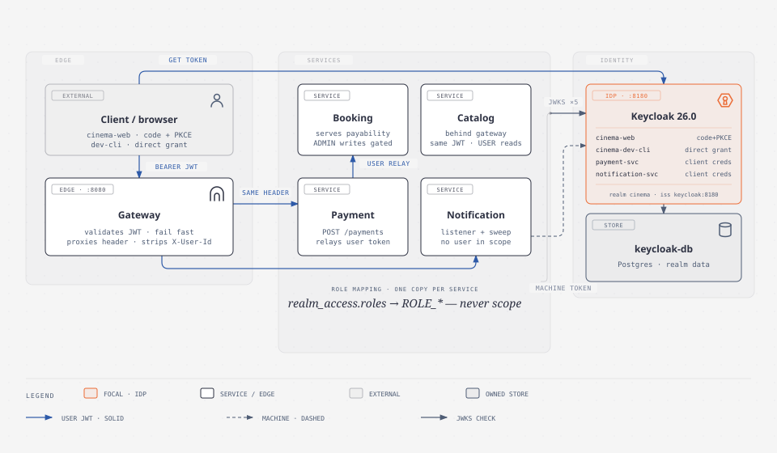

# Keycloak — the Identity Service

Keycloak is the one thing in ScreenMaster that is **not** a service we wrote. It is the system's
**identity provider**: the only component allowed to mint a token, and therefore the only component
every other service has to trust. Nothing else in the cluster stores a password, issues a
credential, or decides who you are.

That is the whole point of putting it here. In the monolith, authentication was a filter reading a
hand-signed JWT with a hard-coded secret, sitting in the same process as the business logic. Split
that monolith into five services and the question becomes unavoidable: *who checks the token, and
how do five separate processes agree on the answer?* Keycloak is that answer — one issuer, one set
of public keys, five independent validators.

| Facet | Value |
|---|---|
| **Image** | `quay.io/keycloak/keycloak:26.0` |
| **Port** | `8180` (both inside the network and published to the host) |
| **Realm** | `cinema` — imported from [`realms/cinema-realm.json`](realms/cinema-realm.json) |
| **Issuer** | `http://keycloak:8180/realms/cinema` |
| **Database** | `keycloak-db` (its own PostgreSQL — Keycloak owns its data like any other service) |
| **Admin console** | `http://localhost:8180` (bootstrap admin from `KEYCLOAK_ADMIN_USER` / `KEYCLOAK_ADMIN_PASSWORD`) |
| **Token lifespan** | 300s (5 minutes) |

---

## Architecture



📄 Full walkthrough: [`docs/diagrams/architecture-keycloak-identity.md`](../docs/diagrams/architecture-keycloak-identity.md)

The diagram is worth reading before the rest of this file, because the single most important fact
about this system's security is structural: **there is no shared authentication library, and no
service asks another service who you are.** Every service independently verifies the same token
against the same public keys. Remove the gateway from the picture and the services are still
secure.

---

## The realm is code, not console clicks

`compose.yaml` mounts [`realms/`](realms/) at `/opt/keycloak/data/import` and starts Keycloak with
`--import-realm`. The realm therefore comes up correctly from `docker compose up` alone — no one
clicks through the admin console to configure roles, and no one's laptop holds configuration the
repo doesn't.

This matters more than it looks. A realm configured by hand is undocumented infrastructure: it
works on the machine where someone clicked it and nowhere else. A realm in a reviewed JSON file is
a migration — it diffs, it reviews, it rebuilds identically.

> ⚠️ **Every secret in `cinema-realm.json` is a well-known dev value** (`payment-svc-dev-secret`,
> `notification-svc-dev-secret`, the seeded password `password`). Production mints its own realm
> with its own secrets, and services read theirs from env (`NOTIFICATION_SVC_SECRET`, …) — never
> from this file. See [`realms/README.md`](realms/README.md).

---

## What the realm contains

### Roles

| Role | Who | What it unlocks |
|---|---|---|
| `USER` | Cinema customer | creates bookings, reads showtimes, opens checkout sessions |
| `ADMIN` | Cinema operator | inventory/showtime writes, refunds, resilience internals |

`USER` is listed in the realm's `defaultRoles` alongside `offline_access` and `uma_authorization`.
That single line **is the signup feature**: Keycloak's self-registration is enabled
(`registrationAllowed: true`), so a brand-new user is granted `USER` automatically and can book
immediately. No custom registration endpoint, no user table in any of our services, no
"create account" code to write or maintain.

### Clients

Four clients, and the split between them is deliberate:

| Client | Type | Flow | Why it exists |
|---|---|---|---|
| `cinema-web` | public | Authorization Code + PKCE | the real user-facing client (browser) |
| `cinema-dev-cli` | public | Direct Access Grant **only** | one-line token for curl/scripts |
| `payment-svc` | confidential | client credentials | Payment's own machine identity |
| `notification-svc` | confidential | client credentials | Notification's own machine identity |

**Why `cinema-dev-cli` is a separate client rather than a flag on `cinema-web`:** the Direct Access
Grant (a.k.a. the password grant) means "send me a username and password and I'll hand back a
token." It is convenient for a script and wrong for a browser — it requires the client to *handle
the user's password*, which is precisely what Authorization Code + PKCE exists to avoid. Enabling it
on `cinema-web` would leave a password-grant path permanently open on the production client. Keeping
it on a dedicated dev client means the capability is scoped to the thing that needs it, and deleting
that one client removes it entirely.

**Public vs confidential:** a public client (a browser app) cannot keep a secret — anyone can read
the JavaScript — so it gets none, and PKCE protects the flow instead. A confidential client runs on
a server, can hold a secret, and uses it to authenticate as *itself*.

### Seeded users

| User | Password | Roles | Email |
|---|---|---|---|
| `alice` | `password` | `USER` | `alice@screenmaster.local` |
| `admin` | `password` | `USER`, `ADMIN` | `admin@screenmaster.local` |

### Least privilege, concretely

The `notification-svc` service account holds exactly one client role: `view-users` on Keycloak's
built-in `realm-management` client. It needs that to look up a user's email address by `sub` when
sending a booking confirmation. It is **not** a realm admin, and the difference is the whole
principle — a compromised Notification service can read user profiles and nothing else. It cannot
create users, grant roles, or change the realm.

---

## The three token paths

Every service-to-Keycloak and service-to-service interaction in ScreenMaster is one of exactly
three shapes. Knowing which one applies to a given call is most of what "securing microservices"
actually means.

### 1. The user's JWT, validated at every hop

The client gets a token from Keycloak and sends it as `Authorization: Bearer …` to the gateway.
The gateway validates it — signature against Keycloak's public keys, expiry, issuer — and rejects
garbage at the edge before it touches the cluster. Then it proxies the request downstream, and the
service **validates the same token again**.

That repetition is not waste. It is **zero trust**: the gateway's check is a fail-fast
optimization, not a security boundary. A misconfigured route, or a caller that is already inside
the network, must not mean open services. Every service is its own resource server, configured with
the same one line:

```yaml
spring:
  security:
    oauth2:
      resourceserver:
        jwt:
          issuer-uri: ${KEYCLOAK_ISSUER_URI:http://keycloak:8180/realms/cinema}
```

**The gateway configures no `TokenRelay` filter — on purpose.** It proxies headers, so the incoming
`Authorization` header reaches the downstream service byte-identical without any filter. That
propagation *is* the relay at the edge. (`TokenRelay` belongs to the BFF/login pattern where the
gateway *holds* the token on the user's behalf; here the client holds it and the gateway just
forwards it.)

**The gateway strips `X-User-Id`** (`RemoveRequestHeader` on every API route). That header was the
previous identity mechanism, before Phase 7. A header fallback would be a straightforward
authentication bypass — anyone can send `X-User-Id: <victim>` — so no service reads it any more
*and* the edge guarantees a stale one never arrives.

### 2. The user's token, relayed service-to-service

When Payment handles `POST /payments`, it calls Booking's `GET /bookings/{id}/payability` to ask
"may *this person* pay for *this booking*?" It does that by re-attaching **the user's own token**
([`UserTokenRelayInterceptor`](../payment/src/main/java/com/gr74/payment/security/UserTokenRelayInterceptor.java)).

Booking therefore sees the real principal, and its ownership answer is a genuine authorization
check rather than Payment's word about who is calling. The alternative — Payment asserting a
`userId` under its own machine token — is the **confused-deputy problem**: a bug in Payment becomes
a data leak in Booking.

The mechanics matter: the header is rebuilt from the *verified* token value rather than copied from
the inbound header, and the interceptor fires only for a `JwtAuthenticationToken`. A machine-token
or anonymous context relays nothing.

### 3. The service's own machine token

Notification consumes `BookingConfirmed` from RabbitMQ on a `@RabbitListener` thread, seconds after
the user's HTTP request has died. There is no user, no live request, and no `SecurityContext`. So
it authenticates to Keycloak **as itself** with its client id and secret — the client-credentials
grant — and gets a token scoped to what *it* may do
([`MachineTokenProvider`](../notification/src/main/java/com/gr74/notification/security/MachineTokenProvider.java)):

```yaml
spring:
  security:
    oauth2:
      client:
        registration:
          notification-keycloak:
            client-id: notification-svc
            client-secret: ${NOTIFICATION_SVC_SECRET:notification-svc-dev-secret}
            authorization-grant-type: client_credentials
```

**No hand-rolled token cache.** The framework's `OAuth2AuthorizedClientManager` fetches the token on
first use and refreshes it before expiry. A naive cache would race the refresh window under
concurrent listener threads — solved code stays solved.

### The rule that ties them together

> **A user's JWT is never written into a RabbitMQ message.**

The queue is a durable log, so a token in a message is a *credential at rest* — and it would be
expired by the time anything consumed it anyway (tokens live 5 minutes; a retried message may not).
Events carry the `userId` as **opaque data**, and the consumer acts under its own machine identity.

Choosing between path 2 and path 3 comes down to one question: *is there a live user request I am
acting inside?* Yes → relay the user's token. No → act as yourself.

---

## How a service consumes identity

### `realm_access.roles`, not `scope` — the trap worth knowing

Spring Security's default `JwtAuthenticationConverter` reads the `scope` claim and turns each scope
into a `SCOPE_…` authority. Keycloak does populate `scope` — but the roles this system authorizes
on live somewhere else entirely, in the `realm_access.roles` claim:

```json
{ "realm_access": { "roles": ["USER", "ADMIN"] } }
```

With the default converter, **every `hasRole('ADMIN')` silently evaluates to `false`**. No
exception. No log line. Just an endpoint that denies everyone, for reasons nothing reports. It is
the single most common Keycloak + Spring misconfiguration.

`KeycloakRealmRoleConverter` (one copy per service) maps `realm_access.roles` → `ROLE_…`
authorities, and it carries its own unit test proving a token with `realm_access.roles=["ADMIN"]`
actually yields `ROLE_ADMIN`.

**Why every service has its own copy:** the repo draws a hard no-shared-jar boundary between
services. A shared security jar would couple every service's deploy to every other's. The class is
stateless and dependency-free, so the duplication costs nothing at runtime — and buys back
independent deployability, which is the reason for microservices in the first place.

### Two levels of authorization

| Level | Where | What it says |
|---|---|---|
| **Coarse** | `SecurityConfig` filter chain | "this path needs *a* valid token" |
| **Fine** | `@PreAuthorize("hasRole('ADMIN')")` | "and *this* operation needs ADMIN" |

The fine-grained rule sits on the controller method, next to the thing it protects — so it is
visible to anyone reading the endpoint. Booking's `TheaterController` and `ShowtimeController` gate
every inventory and showtime write that way; Payment gates refunds and the resilience actuators.

### What each service leaves public

| Service | Public paths | Why |
|---|---|---|
| all | `/actuator/health**` | a gated health endpoint hangs orchestration probes |
| all | `/v3/api-docs/**`, `/swagger-ui**` | the contract, not the data |
| catalog | `GET /movies/**` | "browse before you sign up" must work |
| payment | `POST /payments/webhooks/**` | gateway callbacks carry no JWT — they are authenticated by **HMAC over the raw body** |
| payment | `/payments/sandbox/checkout/**` | the fake provider's hosted page |
| gateway | `POST /api/payments/webhooks/**` | same webhooks, matched on the *incoming* path (before `StripPrefix`) |

`permitAll` on the webhook route is not a hole: the sender is proven by signature instead of by
token. Some callers legitimately cannot hold a JWT, and the answer is a different proof of origin —
not a weaker one.

### `@CurrentUser` — the seam

Every controller that needs the caller's id declares `@CurrentUser String userId` and stays
oblivious to where that id comes from. The resolver reads the verified JWT's `sub` claim (Keycloak
mints it as the user's UUID). Because the filter chain has already checked signature, expiry and
issuer, that `sub` is a *trusted identity*, not a client assertion.

This is what made the Phase-7 migration cheap: the `bookings.user_id` column is `VARCHAR(36)` and a
Keycloak `sub` lands in the same column the old header value did. Controller signatures, service
signatures and the schema were all unchanged — only the resolver's source of truth moved.

See [`docs/concepts/current-user-resolution.md`](../docs/concepts/current-user-resolution.md).

### Errors are coded, never opaque

`SecurityProblemSupport` (one per service) renders authentication and authorization failures as
RFC 9457 `ProblemDetail` bodies — `application/problem+json`, with a machine-readable `code` — so a
401 or 403 is never an empty response a caller has to guess about.

---

## Two configuration traps

### Lazy JWKS, eager issuer check

Each service's `JwtDecoder` is built from the JWKS URL derived from the issuer URI:

```java
NimbusJwtDecoder decoder =
        NimbusJwtDecoder.withJwkSetUri(issuerUri + "/protocol/openid-connect/certs").build();
decoder.setJwtValidator(JwtValidators.createDefaultWithIssuer(issuerUri));
```

This is **not** Boot's default `issuer-uri` discovery, and the difference is operational. Eager
discovery performs an OIDC metadata fetch *at bean creation* — which makes every service unbootable
whenever Keycloak is briefly unreachable, and forces the test suite to need a live Keycloak. The
lazy decoder moves the first network call to the first request: **boot never depends on the IdP**,
while `createDefaultWithIssuer` still pins the `iss` claim so a token minted by any other issuer is
rejected.

One URI feeds both the key source and the accepted issuer, which makes the classic issuer-mismatch
bug impossible — they cannot drift apart because they are the same string.

This is also why nothing in `compose.yaml` gates on Keycloak's health: services boot fine without
it.

### One issuer, strictly

```yaml
KC_HTTP_PORT: 8180
KC_HOSTNAME: http://keycloak:8180
KC_HOSTNAME_ADMIN: http://localhost:8180
KC_HOSTNAME_STRICT: "true"
```

A token's `iss` claim must match what the validator expects, **character for character**. If
Keycloak minted `iss: http://localhost:8180/...` for a host-fetched token while services expected
`http://keycloak:8180/...`, every such token would be rejected with a validation error that reads
like a signature problem. Pinning `KC_HOSTNAME` to the in-network URL means there is exactly one
issuer string in the system; `KC_HOSTNAME_ADMIN` lets the console still work from your browser
without changing what gets minted.

---

## Running and using it

```bash
docker compose up -d keycloak          # first boot runs DB migrations + realm import (~30-60s)
docker compose logs -f keycloak        # watch for "Imported realm cinema"
```

Get a token and call something:

```bash
TOKEN=$(./scripts/get-token.sh alice)          # USER
TOKEN=$(./scripts/get-token.sh admin)          # USER + ADMIN

curl -H "Authorization: Bearer $TOKEN" http://localhost:8080/api/bookings/my
```

[`scripts/get-token.sh`](../scripts/get-token.sh) uses the Direct Access Grant against
`cinema-dev-cli`. It fails loudly — non-zero exit and a message on stderr — when Keycloak is down or
the credentials are wrong, rather than printing an empty token that produces a confusing 401 three
commands later.

Inspect what you got (the `realm_access.roles` claim is the one to look at):

```bash
echo "$TOKEN" | cut -d. -f2 | base64 -d 2>/dev/null | python3 -m json.tool
```

### Troubleshooting

| Symptom | Likely cause |
|---|---|
| `401` on every call, token looks valid | `iss` mismatch — check `KC_HOSTNAME` vs the service's `issuer-uri` |
| `403` on an admin endpoint as `admin` | role converter not wired — `hasRole` is reading `scope`, not `realm_access.roles` |
| `401` after ~5 minutes of work | token expired (300s lifespan) — fetch a new one |
| Services start but every call 401s | Keycloak not up yet; the lazy decoder means services boot anyway |
| `get-token.sh` says it cannot reach Keycloak | `docker compose up keycloak`, then wait for the health check |

---

## Where to look

| I need… | Go to |
|---|---|
| The realm file itself | [`realms/cinema-realm.json`](realms/cinema-realm.json) · [`realms/README.md`](realms/README.md) |
| The diagram walkthrough | [`docs/diagrams/architecture-keycloak-identity.md`](../docs/diagrams/architecture-keycloak-identity.md) |
| JWT / OAuth2 theory | [`docs/concepts/security-jwt-oauth2.md`](../docs/concepts/security-jwt-oauth2.md) |
| Clients and scopes, in depth | [`docs/concepts/keycloak-clients-and-scopes.md`](../docs/concepts/keycloak-clients-and-scopes.md) |
| How `@CurrentUser` resolves | [`docs/concepts/current-user-resolution.md`](../docs/concepts/current-user-resolution.md) |
| The phase plan this came from | [`docs/plans/2026-09-20-phase7-keycloak-security.md`](../docs/plans/2026-09-20-phase7-keycloak-security.md) |
