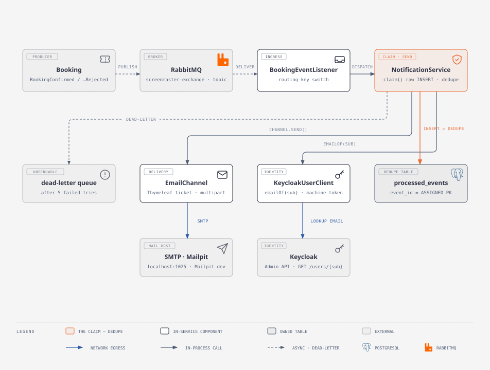

# Notification Service

The **event consumer** of ScreenMaster — the one service with **no HTTP API**. It does not serve a single endpoint; its only inputs are RabbitMQ messages and its only output is email. It listens for `BookingConfirmed` and `BookingConfirmationRejected` off the shared `screenmaster-exchange`, sends the customer a real HTML ticket (or a refund notice), and makes sure that send happens **at most once per event** — which is the whole reason it exists.

It owns `notification-db` with exactly one table, `processed_events`, and depends on nothing that Booking or Catalog knows about: every fact a ticket needs was **snapshotted onto the event by Booking**, so this consumer can be down for a day and the tickets still send when it comes back.

| Facet | Value |
|---|---|
| **Port** | `8084` |
| **Database** | `notification-db` (PostgreSQL, Liquibase-migrated, `ddl-auto=validate`) |
| **Async input** | `BookingConfirmed` / `BookingConfirmationRejected` → `notification-booking-events-queue` |
| **HTTP API** | none — no controllers, no inbound REST at all |
| **Outbound calls** | Keycloak Admin API (recipient lookup), SMTP (mail) |
| **Failure path** | 5 retries with backoff, then dead-letter → `notification-booking-events-dlq` |

---

## Architecture



The consume path runs left to right — **Booking** publishes two event types into the shared topic exchange, **RabbitMQ** delivers them off Notification's own queue, **BookingEventListener** (a deliberately thin AMQP shell) dispatches on the routing key, and **NotificationService** does the real work: *claim, then send.* The coral node is `claim()` — the idempotent-consumer dedupe INSERT — because that is the only place a real invariant is defended in this service.

`NotificationService` is a plain `@Transactional` service, deliberately **not** the `@RabbitListener` itself, so it is unit-testable without a broker. The listener is a shell over it. Both methods — `processBookingConfirmed` and `processBookingConfirmationRejected` — run the same two steps, in the same order:

1. **claim** — `processedEvents.claim(eventId, eventType, now)` — a raw `INSERT` into `processed_events`
2. **send** — resolve the recipient from Keycloak, then `channel.send(...)` the rendered email

If step 2 throws, the transaction rolls back taking the claim with it, and the broker redelivers — the retry re-claims cleanly and tries again. See below for why the ordering is the whole point.

📄 Full walkthrough: [`docs/diagrams/architecture-notification-service.md`](docs/diagrams/architecture-notification-service.md)

---

## Idempotency — the claim IS the dedupe

RabbitMQ is **at-least-once**: a consumer crash before the ack, a broker restart, or `--scale notification=2` can all deliver the same event twice. So the send must be a no-op on the second delivery. The guard is the **`processed_events` INSERT, not a check**:

- `event_id` is an **ASSIGNED primary key** — the inbound event's id (Booking's outbox row id), never one this service mints. A redelivered event carries the same id as its first delivery, so the insert collides.
- The service catches the resulting `DataIntegrityViolationException`, marks the transaction rollback-only, and returns `false` — **ack-and-no-op, never a rethrow**.
- There is deliberately **no `existsById(...)` first**. That read-then-insert has a window where two concurrent consumers both pass the check and both send. The **PK constraint arbitrates, not application code.**

Why a raw `INSERT` and not `saveAndFlush`? `ProcessedEvent`'s PK is an *assigned* id, and Spring Data's `save()` treats an entity with an assigned id as "not new" and `merge()`s it — re-saving the same eventId silently becomes an UPDATE (or a no-op) instead of failing the insert, so the dedupe would never fire. A native `INSERT` always attempts to create the row; a duplicate reliably violates the PK, and the repository proxy hands the service a coded `DataIntegrityViolationException`.

**Ordering is load-bearing.** The Keycloak lookup happens *after* the claim on purpose. If the IdP is down, the transaction rolls back, taking the claim with it, so the redelivery re-claims cleanly. Looking the address up *before* the claim would burn the claim on an outage without sending anything.

> ⚠️ **Known gap — the exactly-once residual.** This is at-least-once with an idempotent consumer, i.e. exactly-once *in effect*. One real hole remains, now that the side effect leaves the process: a crash after SMTP accepted the message but before the transaction commits rolls back the claim, and the redelivery sends a **second email**. It cannot be closed without a distributed transaction. Against a provider that supports it you would pass `eventId` as the provider's own idempotency key (the SES/SendGrid message id) and let the provider collapse the duplicate; local SMTP has no such key, so this is documented rather than claimed as solved. The javadoc on `NotificationService` says exactly this.

Contrast worth carrying: Booking's `MovieProjector` is idempotent **for free** — its PK is the assigned movie id, so a redelivery just rewrites the same row. Notification's side effect — an email — is **not naturally idempotent**, which is precisely why it needs a dedupe table.

---

## The consume path

**`BookingEventListener`** receives a `Map<String,Object>` — **not** typed records. Booking's outbox relay publishes maps (it parses the stored JSON and injects the outbox row id as `eventId`), so the `__TypeId__` header names `java.util.LinkedHashMap` and the JSON converter resolves it ahead of the listener method's parameter type; typed params could never bind. The listener therefore switches on the received routing key and converts to the records Notification owns. It also **restores the trace** from the `traceparent` header the relay stamped on the message: the outbox hop means the trace was never propagated automatically, so it is rebuilt here as a child span and the traceId pushed to MDC in a try/finally — the "email sent" log line carries the same trace id as the booking that caused it.

The queue owns the DLQ: after 5 attempts (2s, 4s, 8s, 16s, 30s — ~60s of grace), a message is rejected (`default-requeue-rejected: false`) and lands in `notification-booking-events-dlq` via `notification-dlx`. The distinction that matters:

| Error | Code | Retry? |
|---|---|---|
| Keycloak unreachable / token refused | `NOTIFICATION_IDENTITY_UNAVAILABLE` | yes — the message stays queued and redelivers with backoff |
| User has no email address | `NOTIFICATION_RECIPIENT_UNKNOWN` | **no** — redelivery cannot conjure an address, so it dead-letters where a human can inspect it |

A ticket that cannot be sent is a customer problem, not a log line.

## The email path

`EmailChannel` is transport, not meaning. It receives a `Notification` (recipient, subject, template name, variable map) and turns it into bytes on a socket; `NotificationService` decides *what* to say. The seam is the `NotificationChannel` interface — the same shape an `SmsChannel` would implement without touching the service.

- **Templates:** `templates/email/booking-confirmed.html` (the ticket) and `booking-rejected.html` (the refund notice). The confirmed template renders **one ticket card per seat**, in a single email — a party of four gets one message, not four.
- **`multipart/alternative`:** plain text + HTML. A client that cannot render HTML still gets a readable ticket, and spam filters score multipart/alternative better than HTML-only. Every variable the template touches is named explicitly in one map (`confirmedVariables`), including the ones that may be null — Thymeleaf would otherwise render a renamed field as a silently blank ticket, and naming them all keeps the contract between the service and the template visible in one place.
- **Poster rendering:** the event carries TMDB's *path*; `NotificationProps.Image.posterUrl()` composes `{baseUrl}/{posterSize}{path}` at render time, so changing the CDN or the image size does not require re-syncing stored data. A null poster is a real case — the template drops the image band entirely, and every fact sits on a solid background because most clients block remote images anyway.
- **Email masking in logs:** `alice@screenmaster.local` → `a***@screenmaster.local`. The domain is kept because it is what you debug with; the local part is dropped because it is what identifies a person.

## The identity lookup

The event carries `userId` — an opaque Keycloak `sub`, not an email, and nothing in Booking, Catalog, or Payment stores one. Identity owns the address; whoever needs it asks Identity. `KeycloakUserClient.emailOf(sub)` calls `GET /admin/realms/cinema/users/{sub}` authenticating as **the service itself** — a machine token (client-credentials grant, `MachineTokenProvider`, least-privilege `view-users` role) — because this runs on a RabbitMQ consumer thread seconds after the user's request died, with no user token to relay.

The lookup is **Caffeine-cached** (`user-emails`, 10m TTL, bounded 10k, expire-after-write) because it sits on the consume path of *every* booking event. The one thing deliberately not cached is the failure — Spring's cache only stores the returned value, so a "Keycloak was restarting" blip is retried rather than remembered.

## No API surface

There is deliberately **no API surface section** in this README, and that absence is the point. Notification is the only service in the repo with no controllers: it carries web-mvc solely to advertise a port and serve `/actuator/health`, and the security filter chain guards only that operational surface with a default-deny on everything else. Its business path is the broker, which carries no token by design — a user JWT in a queue message would be a credential at rest *and* expired by consume time. The day this service grows an HTTP endpoint, the fence (`SecurityConfig`) is already up.

---

## Patterns used here

Each is wired in real code, not demoed.

| Pattern | Where it lives | Why it's here |
|---|---|---|
| **Event-driven integration** | `BookingEventListener`, `RabbitConfig` | Booking publishes to a topic exchange knowing nothing about consumers; Notification owns its queue and both bindings. Adding this consumer required **zero producer changes**. |
| **Idempotent consumer** | `NotificationService.claim`, `ProcessedEventRepository.claim`, `processed_events` | At-least-once delivery made exactly-once *in effect*: the assigned-PK INSERT is the dedupe, and the PK constraint — not a read-then-insert — arbitrates the race. |
| **Database per service** | `notification-db`, no cross-service FKs | The boundary is the schema. The event id is the only shared key, and it is never minted here. |
| **Snapshotting immutable facts** | `BookingConfirmedEvent`, `BookingConfirmationRejectedEvent` | Seats, showtime, theater, screen, movie title, poster *path*, `paymentId`, `reason` all ride on the event so this service never calls Booking back. |
| **Outbox-driven publish (consumer side)** | `BookingEventListener` (Map payload + traceparent restore) | The producer's outbox relay means the consumer receives maps and must rebuild the trace itself — the cost of never losing a message, paid once. |
| **Machine identity / client-credentials** | `MachineTokenProvider`, `KeycloakUserClient` | Background-thread calls to the IdP use the service's own least-privilege token, not a relayed user token. |
| **Cache-aside with bounded staleness** | `KeycloakUserClient`, `CacheConfig` | Email addresses change rarely but the lookup is hot; a local Caffeine cache with 10m TTL keeps a brief IdP blip from failing sends. |
| **Retry + dead-letter** | `application.yml` (`listener.simple.retry`), `RabbitConfig` DLX/DLQ | Retryable failures (IdP down) get ~60s of backoff; terminal failures (no email) dead-letter where a human can inspect them — never a hot loop. |
| **Channel abstraction** | `NotificationChannel`, `EmailChannel` | The seam that makes the dedupe testable with a stub channel instead of a mail server, and the seam an SMS channel would implement later. |
| **Coded errors** | `NotificationErrorCode`, `NotificationException` | Even without HTTP handlers, every failure carries a stable machine-readable code — the convention's placeholder until this service grows a surface. |
| **Structured logging** | `@Slf4j`, masked emails, trace-id in the pattern | Correlation across the outbox hop, and no personal data in logs. |

---

## Running it

```bash
# needs Postgres, RabbitMQ, Keycloak, and Mailpit (docker compose up -d)
./mvnw -q -pl notification spring-boot:run

./mvnw -q -pl notification test
```

Config is env-var driven with local-dev defaults. The full set (all in `src/main/resources/application.yml`):

| Env var | Default | For |
|---|---|---|
| `NOTIFICATION_DB_URL` / `_USER` / `_PASSWORD` | `jdbc:postgresql://localhost:5432/notification` / `postgres` / `postgres` | the dedupe table |
| `RABBITMQ_HOST` / `_PORT` / `_USER` / `_PASSWORD` | `localhost` / `5672` / `guest` / `guest` | the broker |
| `MAIL_HOST` / `_PORT` / `_USERNAME` / `_PASSWORD` | `localhost` / `1025` / (empty) | Mailpit locally; SES/SendGrid in production |
| `MAIL_SMTP_AUTH` / `MAIL_SMTP_STARTTLS` | `false` / `false` | a real provider sets these `true` — still no code change |
| `KEYCLOAK_SERVER_URL` / `KEYCLOAK_REALM` / `KEYCLOAK_ISSUER_URI` | `http://keycloak:8180` / `cinema` | the Admin API lookup + JWT validation |
| `NOTIFICATION_SVC_SECRET` | dev default only | the `notification-svc` client secret for the machine token |
| `NOTIFICATION_MAIL_FROM` / `_FROM_NAME` | `tickets@screenmaster.local` / `ScreenMaster` | the envelope From: |
| `NOTIFICATION_IMAGE_BASE_URL` / `_POSTER_SIZE` | `https://image.tmdb.org/t/p` / `w780` | poster URL composition |
| `NOTIFICATION_EMAIL_CACHE_TTL` / `_MAX_SIZE` | `10m` / `10000` | recipient cache bounds |
| `EUREKA_SERVICE_URL` / `ZIPKIN_ENDPOINT` / `TRACING_SAMPLE_RATE` | localhost defaults | discovery + tracing |

---

## Where to look

| I need… | Go to |
|---|---|
| Why the service is shaped this way | [`docs/diagrams/architecture-notification-service.md`](docs/diagrams/architecture-notification-service.md) |
| How the dedupe works, with the exact SQL | `NotificationService`, `ProcessedEventRepository` (javadoc is exhaustive) |
| The retry / dead-letter contract | `application.yml` (the `listener` block comment) |
| What a pattern or annotation means | [`../docs/concepts/`](../docs/concepts/) — start with `idempotent-consumer.md`, `notification-channels.md`, `rabbitmq.md` |