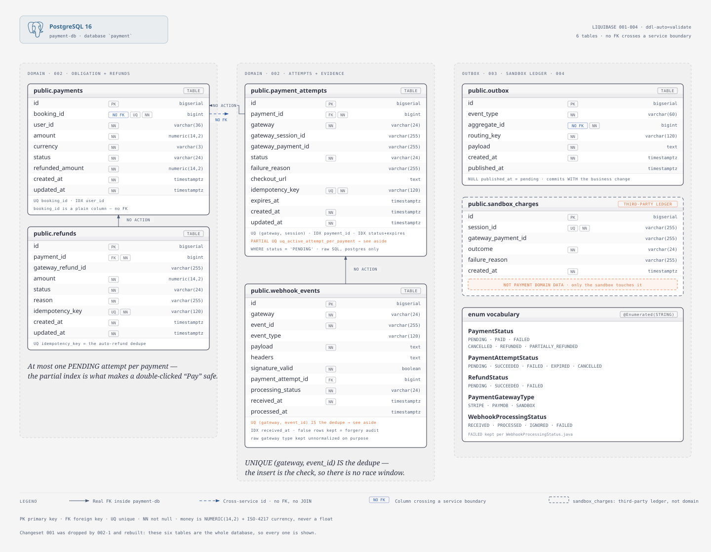
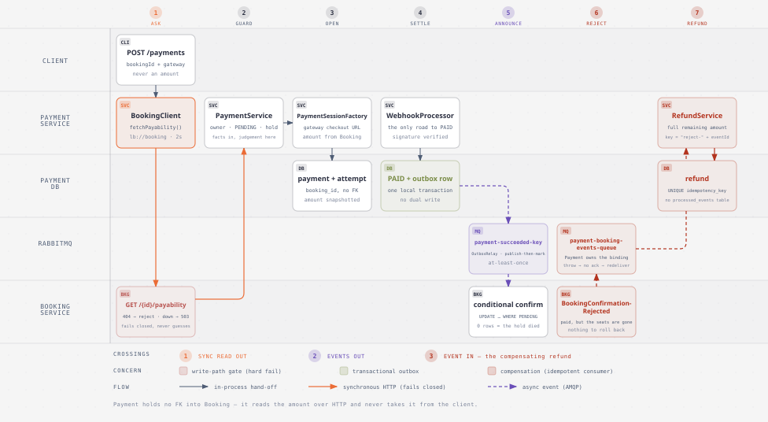

# Payment Service

The money boundary of ScreenMaster. Payment owns one thing the rest of the system must never guess at: **whether a booking has actually been paid for.** It talks to three real gateways behind one port, and it is the service where every distributed-systems failure mode this project exists to teach shows up at once — a network call that cannot be rolled back, a callback that may never arrive, an event that may arrive twice, and a charge that lands after the seats are gone.

It owns `payment-db`, holds **no foreign key into Booking**, and reaches the rest of the system three ways: synchronously over HTTP (`lb://booking`, Eureka-resolved), asynchronously over RabbitMQ, and — uniquely in this system — **inbound from the public internet**, via gateway webhooks authenticated by HMAC signature rather than by JWT.

| Facet | Value |
|---|---|
| **Port** | `8083` |
| **Database** | `payment-db` — the Compose host; database `payment` (PostgreSQL, Liquibase-migrated, `ddl-auto=validate`) |
| **Sync dependency** | `booking` via `BookingClient` (`lb://booking`) |
| **Async input** | `BookingConfirmationRejected` from `screenmaster-exchange` → `payment-booking-events-queue` |
| **Async output** | `PaymentSucceeded` / `PaymentFailed` → `screenmaster-exchange`, via the outbox relay |
| **Gateways** | Stripe (USD) · Paymob (EGP) · Sandbox (EGP+USD) |
| **API docs** | `/swagger-ui.html` · spec at `/v3/api-docs` (aggregated by the gateway on `:8080`) |

---

## Architecture


Three gateway adapters sit behind one interface on the right; the two edges to the rest of the system run down the left; the two background clocks sit underneath. `POST /payments/webhooks/{gateway}` is highlighted because it is the **only path to `PAID`** — no other code in the service may set that status, and if a second one ever appears, that is the bug.

### The one rule that shapes everything

**A database transaction cannot span an external gateway.**

That single constraint explains nearly every structural decision below. You cannot open a transaction, call Stripe, and commit — because if the commit fails, the customer has been charged for something you have no record of, and no rollback can undo it. So every path that touches a gateway is split into *commit, call, commit*:

```
1. INSERT the attempt (PENDING, idempotency key)   -- committed, on its own
2. call the gateway                                -- outside any transaction
3. UPDATE the attempt with the session it returned -- committed, on its own
```

If step 2 times out, step 1 already committed. The failure mode is a **stranded `PENDING` attempt** — recoverable, because reconciliation can go ask the gateway what really happened — rather than an **untracked charge**, which is not recoverable by anything.

This is also why the service has `PaymentWriter`, `WebhookWriter`, `RefundWriter`, and `OutboxWriter` as separate beans rather than `@Transactional` methods on the services that use them. A `@Transactional` method invoked on `this` **is not transactional at all** — Spring's proxy is bypassed on self-invocation. An earlier version declared these writes `REQUIRES_NEW` and called them on `this`; every boundary was silently inert. Injecting a separate bean makes every proxy hop, and therefore every transaction boundary, real.

📄 Full walkthrough: [`docs/diagrams/architecture-payment-service.md`](docs/diagrams/architecture-payment-service.md)

---

## The three gateways

All three implement one interface, `PaymentGateway`. Nothing outside `com.gr74.payment.gateway` ever holds a `PaymentGatewayType` — it holds a `PaymentGateway` — which is why **there is no `if (gateway == STRIPE) … else if (gateway == PAYMOB)` anywhere in this service.** Adding a fourth gateway is a new enum constant plus a new `@Component`; nothing existing changes.

| | **Stripe** | **Paymob** | **Sandbox** |
|---|---|---|---|
| **Adapter** | `StripeGateway` | `PaymobGateway` | `SandboxGateway` |
| **Checkout** | hosted Checkout Session | hosted iframe | our own hosted page |
| **Settles** | `USD` | `EGP` | `EGP`, `USD` |
| **Session creation** | one call | **three** (auth token → register order → payment key) | in-process |
| **Money format** | minor units (cents) | integer piastres (`30050` = 300.50 EGP) | minor units |
| **Signature** | HMAC-**SHA256** over the raw body | HMAC-**SHA512** over a fixed concatenated field list | HMAC-SHA256 over the raw body |
| **Signature channel** | `stripe-signature` **header** | **`?hmac=` query parameter** | `x-sandbox-signature` header |
| **Idempotency** | native `Idempotency-Key` header | none — our key rides as `merchant_order_id` | native |
| **Registered when** | `payment.gateway.stripe.secret-key` is non-blank | `payment.gateway.paymob.api-key` is non-blank | **always** |

### Why two real gateways and not one

Paymob is genuinely unlike Stripe, and that is the point of having both. Every one of those differences — three round-trips instead of one, piastres instead of cents, a signature over a *field list* instead of over the raw body, a query parameter instead of a header, no native idempotency key — stays behind the adapter. The port stays a single `createSession()`. **If a second gateway had been a near-clone of the first, the abstraction would never have been tested.**

Two of those differences are the classic Paymob integration bugs, and both are handled explicitly:

- The HMAC field order is defined by Paymob and must not be "tidied" — `PaymobGateway.HMAC_FIELDS` carries the exact 20 fields in the exact documented order, and reordering them silently breaks every signature.
- The signature arrives on the **query string**, not a header. `WebhookController.signalsFrom` folds headers *and* query parameters into one lower-cased map so no adapter needs to know which channel its gateway chose — with headers winning on collision, so appending `?stripe-signature=…` to a callback URL can never shadow the real one.

### The sandbox is not a mock

`SandboxGateway` implements the same port, is registered the same way, signs its own webhooks with a real HMAC, honours a session TTL, and **calls back over HTTP through the front door** rather than in-process. It has its own hosted pay page (`SandboxCheckoutController`) and its own ledger (`sandbox_charges`) — the fake third party's memory, which no payment domain code ever reads.

The only difference is that its failure rate, latency, and availability are **configurable**, which is what makes the failure script and the circuit-breaker work possible without hammering someone else's sandbox or waiting on a real outage. Its pay page has a third button that **pays while withholding the webhook** — the network-partition stand-in that the reconciliation demo drives.

It is the successor to the monolith's `FakePaymentProvider` and its `FAIL_RATE` knob — but where that fake returned approve/decline *synchronously from the charge call*, teaching a shape no real gateway has, this one opens a session, returns a URL, and reports the outcome later through a signed webhook. **The controllable failure survived; the misleading shape did not.**

### A misconfigured gateway is absent, not broken

Each real adapter is `@ConditionalOnGatewayCredentials`. With no credentials the bean is conditioned out of the application context entirely, so it never appears in `GatewayRegistry` and is never offered to a client. `GET /payments/gateways?currency=EGP` returns only what can actually settle EGP — which is what stops a user picking Paymob for a USD booking and discovering the problem at the gateway.

The custom condition matters: plain `@ConditionalOnProperty` counts an empty string as *present*, and would happily register a credential-less gateway that fails at checkout time.

> **Safety rail:** `StripeGatewayProps` rejects a live `sk_live_` key outside the `production` profile. This project is structurally incapable of moving real money.

---

## Database schema



Six tables in one database. Four are the payment domain, one is infrastructure, one belongs to the fake gateway:

| Table | Role | The constraint that matters |
|---|---|---|
| **`payments`** | the **obligation** — one per booking, created on first sight | `uq_payments_booking_id` — one obligation per booking, enforced by the database, not by a read |
| **`payment_attempts`** | one row per **checkout session**; a payment may have many | `uq_active_attempt_per_payment` — a **partial unique index**, at most one `PENDING` attempt per payment |
| **`refunds`** | the refund ledger | `uq_refunds_idempotency_key` — this constraint **is** the dedupe for the auto-refund |
| **`webhook_events`** | the **evidence store** — every delivery, valid or not | `uq_webhook_events_gateway_event_id` — `UNIQUE (gateway, event_id)` **is** the dedupe |
| **`outbox`** | pending events awaiting the relay | `published_at IS NULL` = pending; the count is the lag signal worth alerting on |
| **`sandbox_charges`** | the fake gateway's own ledger, parked here for the lab | *not payment domain data* — only `SandboxGateway` reads it |

### Obligation vs. attempt — the split worth understanding

The monolith had one `payments` row and one status. This service has **two levels**, and conflating them is the mistake the split exists to prevent:

- A **payment** is what is *owed* for a booking. There is exactly one, ever.
- An **attempt** is one *try* at settling it. A user who lets a checkout page lapse and clicks "Pay Again" gets a second attempt on the *same* payment.

That is why an expired attempt is **not** a payment failure: `AttemptExpirySweeper` closes the dead session, the payment stays `PENDING`, and the user can retry. Nothing is announced, because nothing about the obligation changed.

`booking_id` is a **plain column, not an FK** — Booking is a different service with a different database. The amount in `payments.amount` is snapshotted from Booking's authoritative answer at creation time, and never from the client.

### Two different jobs for two different unique constraints

Both `uq_active_attempt_per_payment` and `uq_webhook_events_gateway_event_id` do work that application code would get wrong:

- The **partial unique index** is what makes a double-clicked "Pay" button harmless. Two concurrent requests both create an attempt; the database rejects the loser, which is told to retry, and the retry finds the winner's live attempt and reuses it. This is a *correct outcome*, not a 500 — `PaymentWriter` catches the violation and renders it as a coded 400.
- The **webhook dedupe is the insert itself**, not a read-then-insert. A check-then-write leaves a window in which two concurrent deliveries of the same event both pass the check. Letting the `INSERT` fail closes that window at the only place it can be closed.

---

## The webhook path — the only road to PAID

```
gateway → POST /payments/webhooks/{gateway}
        → WebhookController   (raw byte[] body — never a parsed DTO)
        → WebhookProcessor    (verify → store → dedupe → apply)
        → WebhookWriter       (two transactions, deliberately not one)
```

**The body is read as `byte[]`.** Signatures are computed over exact bytes; a Jackson round-trip reorders keys and changes whitespace, which breaks verification. A parsed DTO here would silently reject every genuine delivery.

**Signatures are compared in constant time** (`MessageDigest.isEqual`, never `String.equals`) — a timing difference leaks the expected signature byte by byte.

**A forged delivery is stored, then rejected.** `signature_valid = false` rows are written in their own committed transaction *before* the 400 goes back, because a run of them from one source is an attack signature, and discarding the delivery would discard the evidence.

**200 is the answer to almost everything.** A gateway retries any non-2xx for hours. An unknown session, an uninteresting event type, a duplicate — all stored, all answered 200. Only a bad-or-missing signature, or an unknown gateway path segment, gets a 400.

### Two commits, and why not one

The evidence row commits first, on its own. Then the business change **and its outbox row** commit together.

That second commit is the whole point of the outbox: `PAID` and its `PaymentSucceeded` announcement are **one atomic write**, so the dual-write problem — state without event, or event without state — cannot happen. There is no window where a customer is charged and Booking is never told.

A crash *between* the two leaves a `RECEIVED` row with no applied outcome. The next delivery of the same event re-runs the apply, which is safe precisely because every transition underneath is a guarded, idempotent no-op. **That re-run is the crash-safety property — it is not an optimization to remove.**

### Then the relay: publish-then-mark

`OutboxRelay` drains pending rows on a `@Scheduled` tick, claiming them in bounded batches with `SELECT … FOR UPDATE SKIP LOCKED` so overlapping ticks never block on each other. The ordering inside the loop is the guarantee:

- **Publish, then mark.** A crash between the two re-publishes on the next tick — at-least-once delivery, which every consumer is built to absorb.
- **Mark, then publish** would be lossy: a crash in between strands a `PaymentSucceeded` no consumer ever sees. **A lost `PaymentSucceeded` is a customer charged with no booking.**

A broker outage is survivable by construction: the publish throws, the rows stay pending, nothing is marked, nothing is lost.

---

## Recovering from a webhook that never came

A webhook is a callback from a third party over the public internet. It *will* eventually not arrive. `ReconciliationJob` is what makes that survivable rather than fatal.

Every 5 minutes it sweeps attempts stuck `PENDING` past `stale-after` (default 10 minutes), asks the gateway what it believes via `fetchStatus`, and funnels the answer **through the exact same `WebhookProcessor`** — as a synthetic `GatewayEvent` with the id `recon:{attemptId}:{status}`, stored through the same evidence insert and applied by the same `applyOutcome`.

That reuse is deliberate. The `UNIQUE (gateway, event_id)` insert makes a late real webhook, a second reconciliation pass, and the original webhook all **collapse onto one applied outcome**. There is exactly one state-transition path in this service; if a second ever appears beside it, that is the bug.

### The two clocks, and why they don't fight

| Job | Cadence | Asks |
|---|---|---|
| `AttemptExpirySweeper` | 60s | "whose gateway session lapsed unused?" |
| `ReconciliationJob` | 5min | "whose stuck attempt does the gateway have an answer for?" |

Running blind, the 60-second sweeper would close attempts long before the 5-minute reconciliation tick ever asked about them — expiring sessions that were in fact paid. So the sweeper **skips any lapsed attempt still inside the reconciliation window** and leaves it for reconciliation to adjudicate. Only attempts older than the window — ones the gateway's retry backoff has had every chance to report on — are expired blind.

**Reconciliation decides first; blind expiry is only for what the gateway has disowned.** Both jobs read the same `stale-after` property, so the two clocks cannot drift apart.

---

## Integration with Booking



Payment and Booking never share a transaction, a database, or a foreign key. They meet in exactly three places.

### 1. One synchronous call, out — `GET /bookings/{id}/payability`

Booking owns the booking, so it owns the *price*. `BookingClient` fetches a `BookingPayability` of **facts** — status, hold deadline, authoritative amount, owner — with no judgement in it. Payment applies the judgement itself.

**It fails closed.** A Booking outage is a `503 PAYMENT_BOOKING_SERVICE_UNAVAILABLE`, never a payment opened against an invented price. This is the deliberate opposite of Booking's read path, which degrades to `movieTitle: null` on a Catalog outage — a read is more useful partial than absent, but **money must never be guessed at**.

The six guards `POST /payments` runs, in order:

1. the booking must exist and be fetchable (fails closed)
2. it must belong to **this** user — checked even though a booking id is not secret, because otherwise anyone could enumerate ids and open checkouts against other people's bookings
3. it must be `PENDING`
4. its **seat hold** must still be live — a lapsed hold is unrecoverable, unlike a lapsed gateway session, because the seats may already belong to someone else
5. the payment must not already be settled or terminal
6. the requested gateway must be registered **and** able to settle the booking's currency

### 2. Events, out — `PaymentSucceeded` / `PaymentFailed`

Written to the outbox in the same transaction as the state change, relayed to `screenmaster-exchange` on `payment-succeeded-key` / `payment-failed-key`. Payment publishes and forgets; it does not know or care that Booking is listening.

**Payment never calls Booking to confirm a booking.** The saga is choreographed, not orchestrated — nobody is in charge of it.

### 3. Events, in — the auto-refund

`BookingConfirmationRejected` on `payment-booking-events-queue` means the money arrived *after* the seat hold died: the user sat on the gateway's page too long, Booking's conditional confirm matched zero rows, and the seats are gone.

There is nothing to roll back — **the customer has already been charged.** So the saga compensates instead: `BookingConfirmationRejectedListener` calls `RefundService.requestRefund` for the full remaining amount, with the idempotency key derived from the event id (`"reject-" + eventId`).

That derived key is what makes a redelivered rejection harmless without a `processed_events` table anywhere — the `UNIQUE idempotency_key` constraint **is** the dedupe.

A **declined** payment is the easy case by comparison: seats stay held, the user retries until the hold lapses, and nothing needs compensating because no money moved.

📄 Full walkthrough of the three crossings: [`docs/diagrams/process-payment-integration.md`](docs/diagrams/process-payment-integration.md)

📄 The full choreography, from both sides: [`../booking/docs/diagrams/process-booking-payment-saga.md`](../booking/docs/diagrams/process-booking-payment-saga.md)

---

## Design patterns used here

Each is wired in real code, not demoed.

| Pattern | Where it lives | Why it's here |
|---|---|---|
| **Ports & Adapters (Hexagonal)** | `PaymentGateway` + `StripeGateway` / `PaymobGateway` / `SandboxGateway` | The port is shaped around what *every* gateway can do, not around any one gateway's API. Three genuinely different providers behind one interface, and no gateway-specific branch anywhere outside the package. |
| **Strategy** | the same three adapters, selected at runtime | The algorithm for "move this money" is chosen per request. `PaymentSessionFactory` calls `createSession` without ever knowing which implementation it holds. |
| **Registry** | `GatewayRegistry` | Spring injects every `PaymentGateway` bean as a `List` and the dispatch map builds itself. An adapter with no credentials is conditioned out of the context and simply never appears — so a misconfigured gateway is *never offered* rather than failing at checkout. |
| **Anti-corruption layer** | each adapter's normalization | Piastres, cents, and three status vocabularies are translated at the boundary. The domain speaks `BigDecimal` + ISO-4217 + `PaymentAttemptStatus`, and never learns that Paymob calls a decline `error_occured`. |
| **Transactional outbox** | `WebhookWriter.applyOutcome`, `outbox`, `OutboxRelay`, `OutboxWriter` | `PAID` and its `PaymentSucceeded` row are one commit — the dual-write problem cannot occur. Publish-then-mark makes delivery at-least-once, never lossy. |
| **Idempotent consumer** | `WebhookWriter`, `BookingConfirmationRejectedListener`, `RefundService` | Everything is at-least-once: gateways redeliver, the relay republishes, RabbitMQ redelivers. Every write is guarded so a replay changes nothing. |
| **Idempotency key** | `payment_attempts.idempotency_key`, `refunds.idempotency_key` | Forwarded to the gateway where it supports one, so a *transport-level* retry of one attempt is safe. Unique per attempt, because a deliberate retry after a lapsed session is a genuinely new charge and must not dedupe against the old one. |
| **Saga (choreography)** | `BookingConfirmationRejectedListener` → `RefundService` | Two databases, no transaction across them. The unhappy path is a **refund**, not a rollback — the money already moved. |
| **Compensating transaction** | `RefundService.requestRefund` keyed `"reject-" + eventId` | The distributed answer to "undo". Automatic, idempotent, and requiring no operator. |
| **Reconciliation / polling recovery** | `ReconciliationJob` → the same `WebhookProcessor` | Pull-based truth for when push fails. Reusing the webhook path means one state-transition path, and the dedupe collapses every source onto a single applied outcome. |
| **Evidence store / audit log** | `webhook_events` | Every delivery is kept, including forged ones. It is what lets an operator replay a delivery after fixing a bug, and what turns an attack into a log line instead of a silent discard. |
| **Optimistic guard / state machine** | `PaymentAttempt.transitionTo`, `Payment.markPaid`, `Refund.markSucceeded` | Terminal states refuse further transitions, which is what drops out-of-order deliveries: a late `FAILED` can never overwrite a `SUCCEEDED`. Each guard returns a boolean, so "did anything actually change?" drives whether an event is published. |
| **Unique-constraint-as-concurrency-control** | `uq_active_attempt_per_payment`, `uq_webhook_events_gateway_event_id`, `uq_payments_booking_id` | The database arbitrates races, not application code. The insert *is* the check, so there is no window between them. |
| **Separate transactional writer beans** | `PaymentWriter`, `WebhookWriter`, `RefundWriter`, `OutboxWriter` | A `@Transactional` method self-invoked is inert — the proxy is bypassed. Injecting a separate bean makes each boundary a real proxy hop, which matters most here because the design depends on *commit, call, commit*. |
| **Database per service** | `payment-db`, no cross-service FKs | `booking_id` is a plain column. The boundary is the schema. |
| **Snapshotting immutable facts** | `payments.amount`, `payments.currency` | Taken from Booking's authoritative answer at creation and frozen. A later price change never rewrites a charge. |
| **Signature authentication** | `parseAndVerifyWebhook` per adapter | Gateways have no JWT. A constant-time HMAC comparison over exact bytes proves the same thing a token would. |
| **RFC 9457 error contract** | `PaymentErrorCode`, `GlobalExceptionHandler` | Every error is `application/problem+json` with a stable machine-readable `code` siblings can branch on. Errors are thrown, never returned. |
| **Conditional bean registration** | `@ConditionalOnGatewayCredentials` | A blank credential means the bean does not exist — treating "absent" and "misconfigured" as the same thing, which is the safe one. |
| **Auth seam** | `X-User-Id` header | Same seam Booking uses. Phase 7 swaps it for the JWT `sub` with no controller change. |

---

## API surface

**Payments** — `POST /payments` *(create **or reuse** a checkout session — this is also "Pay Again"; 201 created, 200 reused)* · `GET /payments/gateways?currency=` · `GET /payments/{paymentId}` · `GET /payments/by-booking/{bookingId}`
**Refunds** — `POST /payments/{paymentId}/refunds`
**Webhooks** — `POST /payments/webhooks/{gateway}` *(`stripe` | `paymob` | `sandbox` — signature-authenticated, no JWT)*
**Sandbox checkout** *(lab surface)* — `GET /payments/sandbox/checkout/{sessionId}` · `POST /payments/sandbox/checkout/{sessionId}/pay`

`POST /payments` being idempotent at the business level is why "Pay Again" needs no code of its own: it is this endpoint called a second time, finding a lapsed attempt instead of a live one.

### Error codes

`PAYMENT_VALIDATION_ERROR` · `PAYMENT_NOT_FOUND` · `PAYMENT_BOOKING_NOT_FOUND` · `PAYMENT_FORBIDDEN` · `PAYMENT_BOOKING_NOT_PAYABLE` · `PAYMENT_BOOKING_EXPIRED` · `PAYMENT_ALREADY_PAID` · `PAYMENT_GATEWAY_NOT_AVAILABLE` · `PAYMENT_CURRENCY_NOT_SUPPORTED` · `PAYMENT_GATEWAY_UNAVAILABLE` · `PAYMENT_BOOKING_SERVICE_UNAVAILABLE` · `PAYMENT_WEBHOOK_SIGNATURE_INVALID` · `PAYMENT_REFUND_EXCEEDS_REMAINING` · `PAYMENT_NOT_REFUNDABLE` · `PAYMENT_INTERNAL_ERROR`

---

## Running it

```bash
# needs Postgres on :5444 and RabbitMQ on :5672 (docker compose up -d postgres rabbitmq)
./mvnw -q -pl payment spring-boot:run

./mvnw -q -pl payment test
```

With no gateway credentials configured, **the sandbox is the only registered gateway** — which is enough to drive the whole flow end to end, including its hosted pay page and its signed webhooks.

### Configuration

Env-var driven with local-dev defaults:

| Group | Variables |
|---|---|
| **Infrastructure** | `PAYMENT_DB_URL`, `PAYMENT_DB_USER`, `PAYMENT_DB_PASSWORD`, `RABBITMQ_HOST`, `EUREKA_SERVICE_URL` |
| **Public callback base** | `PAYMENT_PUBLIC_URL` — gateways **cannot reach `localhost`**, so local dev needs a tunnel (`stripe listen --forward-to …`, or `ngrok http 8080` for Paymob) |
| **Clocks** | `PAYMENT_OUTBOX_RELAY_INTERVAL_MILLIS` (2s), `PAYMENT_EXPIRY_SWEEP_INTERVAL_MILLIS` (60s), `PAYMENT_RECONCILIATION_SWEEP_INTERVAL_MILLIS` (5min), `PAYMENT_RECONCILIATION_STALE_AFTER` (PT10M) |
| **Sandbox knobs** | `PAYMENT_SANDBOX_FAILURE_RATE`, `PAYMENT_SANDBOX_UNAVAILABLE_RATE`, `PAYMENT_SANDBOX_LATENCY_MILLIS`, `PAYMENT_SANDBOX_SESSION_TTL` |
| **Stripe** | `STRIPE_SECRET_KEY`, `STRIPE_WEBHOOK_SECRET`, `STRIPE_CURRENCIES`, `STRIPE_ALLOW_LIVE_KEY` |
| **Paymob** | `PAYMOB_API_KEY`, `PAYMOB_HMAC_SECRET`, `PAYMOB_INTEGRATION_ID`, `PAYMOB_IFRAME_ID`, `PAYMOB_CURRENCIES` |

Secrets are never committed. Leaving a gateway's credentials blank removes it from the deployment.

---

## Known gaps

- **A refund whose confirming webhook never arrives stays `PENDING` indefinitely.** Reconciliation sweeps *attempts*, not refunds — the refund-side twin of the payment reconciliation gap, and a deliberate, named limit of this phase.
- **An ambiguous Paymob refund correlation is left for an operator.** When a Paymob callback names a transaction but no refund id, and the payment has more than one `PENDING` refund, the event is stored, answered 200, and applied to nothing rather than guessing which refund it meant.
- **No circuit breaker yet.** A gateway that is down is retried on every request. Resilience4j is Phase 5; the sandbox's `unavailable-rate` knob exists to drive that work.

---

## Where to look

| I need… | Go to |
|---|---|
| Why the service is shaped this way | [`docs/diagrams/architecture-payment-service.md`](docs/diagrams/architecture-payment-service.md) |
| How the tables fit together | [`docs/diagrams/payment-db-schema.md`](docs/diagrams/payment-db-schema.md) |
| How the cross-service reads work | [`docs/diagrams/process-payment-integration.md`](docs/diagrams/process-payment-integration.md) |
| The booking↔payment choreography | [`../booking/docs/diagrams/process-booking-payment-saga.md`](../booking/docs/diagrams/process-booking-payment-saga.md) |
| Gateways, sessions, webhooks, signatures | [`../docs/concepts/payment-gateway-integration.md`](../docs/concepts/payment-gateway-integration.md) |
| The outbox, in depth | [`../docs/concepts/transactional-outbox.md`](../docs/concepts/transactional-outbox.md) |
| Sagas and compensation | [`../docs/concepts/saga-pattern.md`](../docs/concepts/saga-pattern.md) |
| Why every consumer is idempotent | [`../docs/concepts/idempotent-consumer.md`](../docs/concepts/idempotent-consumer.md) |
| What a pattern or annotation means | [`../docs/concepts/`](../docs/concepts/) |
| What's next for this service | [`../docs/BUILD_PLAN.md`](../docs/BUILD_PLAN.md) |
