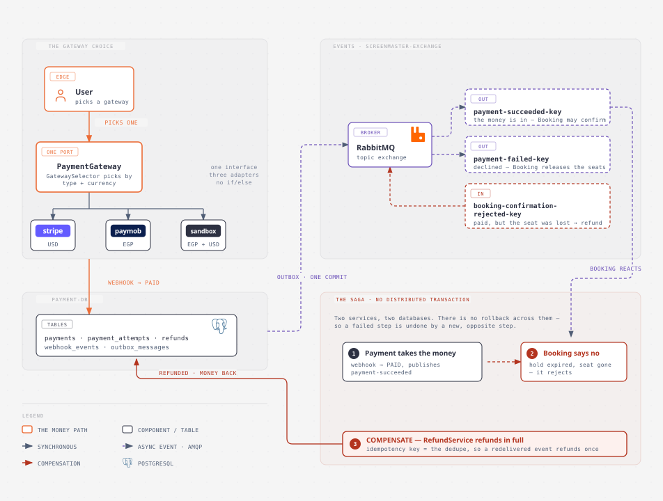

# Payment · Service Architecture

**Type:** high-level (architecture) · **Scope:** the `payment` service, at a glance
**Files:** `architecture-payment-service.html` (source) · `.svg`



## What to learn here

Four things, and deliberately nothing else: **the user picks a gateway**, that choice runs through
**one port with three adapters**, the service **owns one database**, and it talks to the rest of the
system **only through RabbitMQ events** — including the compensating refund that makes the
booking–payment **saga** work without a distributed transaction.

This is the orientation diagram. The details it leaves out (the reconciliation job, the expiry
sweeper, the webhook signature schemes, the six-table schema) live in the sidecars listed under
*Where the detail went*.

## The gateway choice (left)

The user picks **Stripe**, **Paymob**, or **Sandbox**. Every one of them is reached through the same
`PaymentGateway` port — `GatewaySelector` resolves the bean by **type + currency**, so no gateway
`if/else` exists anywhere outside the `gateway/` package. Adding a fourth gateway is a new enum
constant plus a `@Component`; no existing code changes.

| Gateway | Currency | Why it's here |
|---|---|---|
| **Stripe** | USD | a real hosted checkout, test mode |
| **Paymob** | EGP | a real iframe checkout, sandbox |
| **Sandbox** | EGP + USD | ours, controllable — configurable failure rate makes the failure paths demoable |

The orange stroke marks **the money path**: user → port → adapter → the gateway's webhook → `PAID`.
The webhook is the *only* transition into `PAID`. A client cannot assert it paid; only a signed
callback from the gateway can.

## The database (bottom left)

One Postgres, `payment-db`, owned outright. Five tables carry the story: `payments`,
`payment_attempts`, `refunds`, `webhook_events` (the idempotency ledger), and `outbox_messages`.
No FK crosses a service boundary — Booking's ids are snapshotted values here, not foreign keys.

## The events (right)

Everything crossing to another service is an **async event on `screenmaster-exchange`** (dashed,
purple). Nothing about a booking is written by a synchronous call from Payment.

| Direction | Routing key | Means |
|---|---|---|
| **out** | `payment-succeeded-key` | the money is in — Booking may confirm |
| **out** | `payment-failed-key` | declined — Booking releases the seats |
| **in** | `booking-confirmation-rejected-key` | we took money for a seat Booking could not give |

Both outbound events are written **in the same transaction as the payment row**, into
`outbox_messages`, and relayed afterwards. That is the point of the outbox: the DB write and the
publish cannot disagree, because there is only one commit.

## The saga (bottom right)

The compact strip is the whole lesson of Phase 3. Payment and Booking have **separate databases**,
so there is no transaction spanning both and nothing to roll back. Instead:

1. **Payment takes the money** — webhook → `PAID`, publishes `payment-succeeded`.
2. **Booking says no** — the 15-minute hold lapsed and the seat is gone, so it rejects and emits
   `booking-confirmation-rejected`.
3. **Compensate** — `BookingConfirmationRejectedListener` → `RefundService` refunds in **full**,
   automatically. The refund's idempotency key *is* the dedupe, so a redelivered event refunds once.

Step 3 is the definition of a saga: a failed step is undone by a **new, opposite step**, not by a
rollback. The red stroke is reserved for it.

## Patterns → concepts

- **Ports & adapters / strategy** → [concepts/payment-gateway-integration.md](../../../docs/concepts/payment-gateway-integration.md)
- **Transactional outbox** → [concepts/transactional-outbox.md](../../../docs/concepts/transactional-outbox.md)
- **Saga / compensating transaction** → [concepts/saga-pattern.md](../../../docs/concepts/saga-pattern.md)
- **Idempotent consumer** → [concepts/idempotent-consumer.md](../../../docs/concepts/idempotent-consumer.md)

## Where the detail went

This diagram was deliberately reduced from a denser earlier version. What it dropped, and where to
find it instead:

| Dropped | Now read |
|---|---|
| the six tables, columns, and constraints | `payment-db-schema.md` |
| the full step-by-step saga with both services | `booking/docs/diagrams/process-booking-payment-saga.md` |
| `ReconciliationJob`, `AttemptExpirySweeper` | `payment/README.md` |
| per-gateway signature schemes, TTLs, HMAC details | `payment/README.md` + the adapter classes |
| the synchronous `BookingClient` payability check | `booking/docs/diagrams/process-booking-integration.md` |

Keeping those out is what makes this one readable at a glance — it answers *what is this service*,
not *how does every part of it work*.

## Icons

| Icon | Style | Source |
|---|---|---|
| stripe · paymob · sandbox | filled wordmark chips, brand colours | inline (no network fetch) |
| user | stroked 1.5px, Tabler idiom | custom, matches the booking diagram's set |
| PostgreSQL, RabbitMQ | filled silhouette | Simple Icons (CC0) |

The three gateway marks are inline wordmarks rather than the official logotypes — the CSP-free,
offline-safe option, and enough to make the "pick one" reading instant.

## Regenerating

The `.svg` is the first `<svg>` node of the HTML with a Google Fonts `@import` injected. The `.png`
is a 2× Playwright screenshot of that node:

```bash
python3 - <<'EOF'
import pathlib
from playwright.sync_api import sync_playwright
with sync_playwright() as p:
    b = p.chromium.launch()
    pg = b.new_page(viewport={"width":1400,"height":1200}, device_scale_factor=2)
    pg.goto(pathlib.Path("architecture-payment-service.html").resolve().as_uri())
    pg.wait_for_timeout(2500)
    pg.locator("svg").screenshot(path="architecture-payment-service.png")
    b.close()
EOF
```
